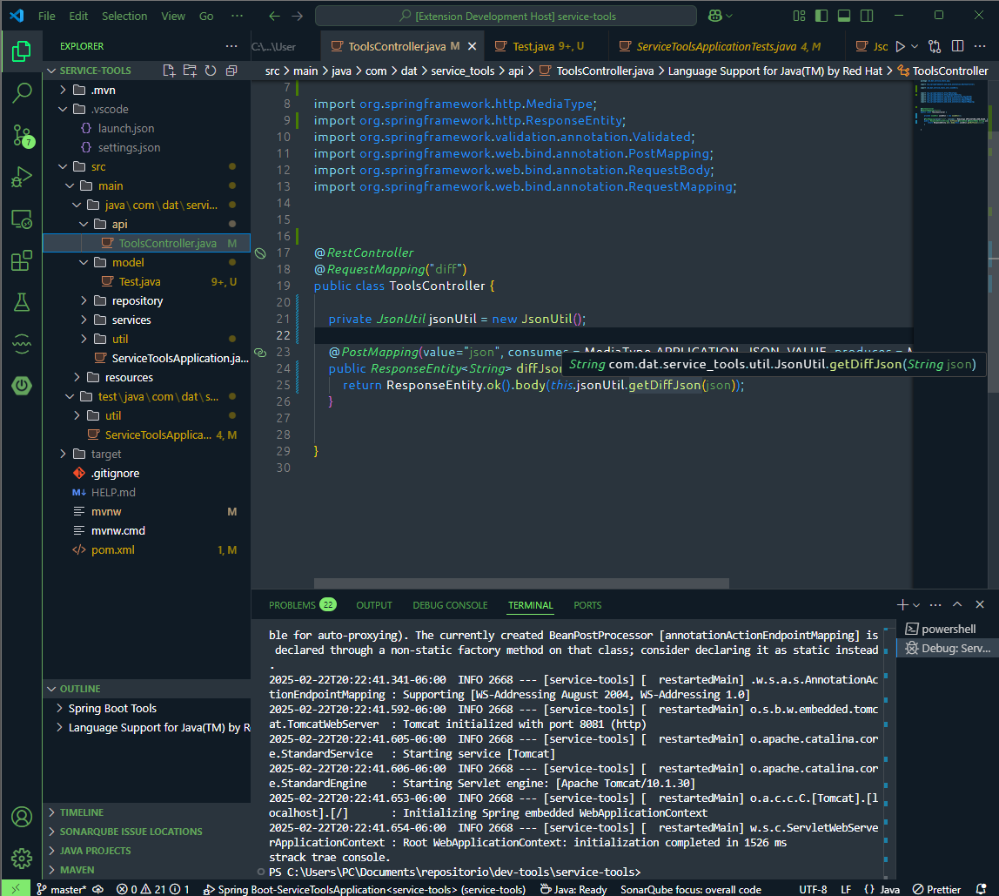
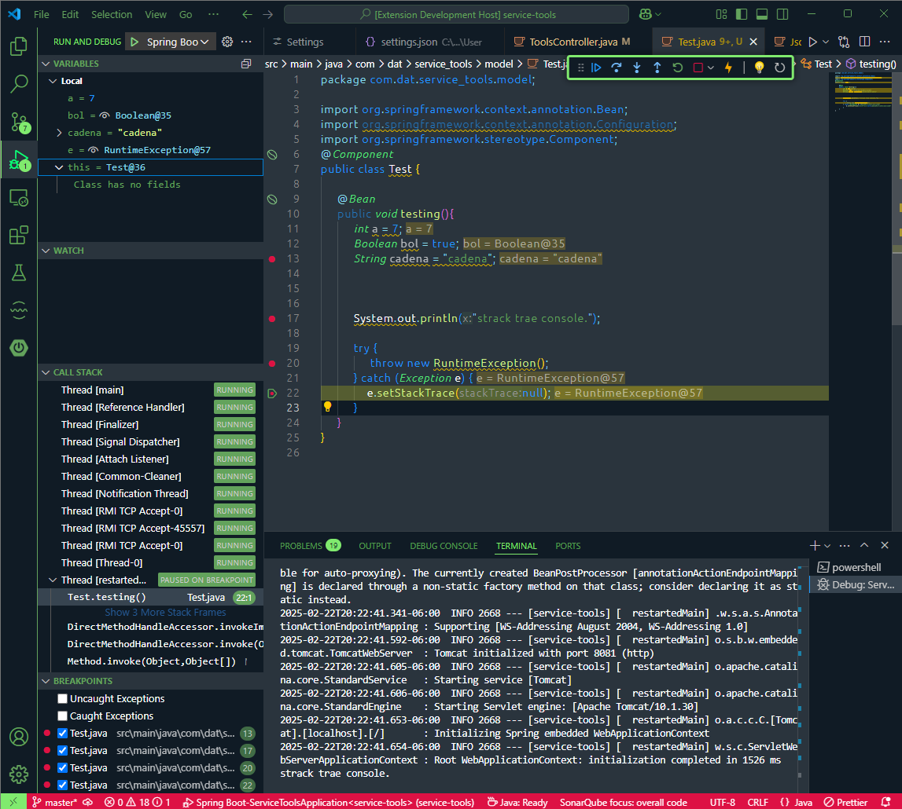

# men-jv-spring Theme

### Description
A sophisticated dark theme/color scheme for Visual Studio Code based on spring framework.

This theme features a much richer use of syntax scopes and color consistency, with due consideration for aesthetics, contrast, and readability.

Give it a try :)

If you like using this, please consider donating a little bit. It takes a lot of time to keep this updated with every VSCode release. 

Thank you , very much.

**Enjoy!**

### screenshot examples:

